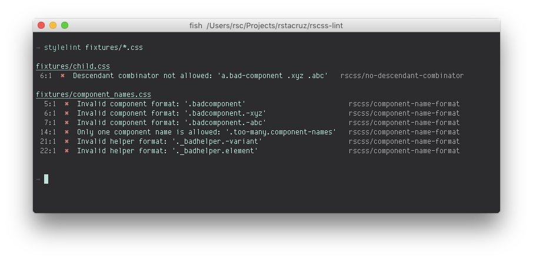
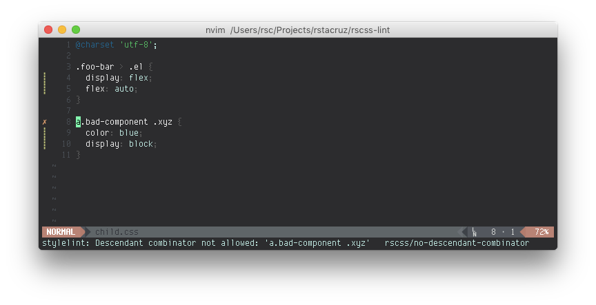

# stylelint-rscss

> Validate CSS (and SCSS, Less, SugarSS) to RSCSS conventions

stylelint-rscss is a plugin for [stylelint] to validate your code against [RSCSS] conventions. It supports SCSS (Sass), SugarSS and Less, as supported by stylelint.

As a stylelint plugin, it can be used with stylelint's [hundreds of rules](http://stylelint.io/user-guide/rules/) or other [stylelint configs](https://github.com/stylelint/stylelint-config-standard) to validate other good CSS practices as well.



[](https://travis-ci.org/rstacruz/stylelint-rscss "See test builds")

<br>

## Quickstart guide

**Install:** Install [stylelint] and stylelint-rscss to your project.

```sh
npm install --save-dev stylelint stylelint-rscss
```

**Configure:** Create a `.stylelintrc` in your project. Use the `stylelint-rscss/config` configuration, which has defaults for strict RSCSS conventions.

```js
// .stylelintrc
{
  "extends": [
    "stylelint-rscss/config"
  ]
}
```

**Add a script:** Add an npm script to your `package.json`.

```js
// package.json
{
  "scripts": {
    "lint:css": "stylelint path/to/css/**/*"
  }
}
```

Run it!

```sh
npm run lint:css
```

<br>

## Recommendations

These steps are not required, but are *highly* recommended:

- Add [stylelint-config-standard](https://www.npmjs.com/package/stylelint-config-standard) as well!
- Configure your text editor to use stylelint. (See [text editor support](#text-editor-support))
- Add `npm run lint:css` to your CI script.

<br>

## Text editor support



You need to install stylelint globally (`npm install -g stylelint`) for text editor support.

```sh
npm install -g stylelint
```

After that, here are the plugins I'd recommend:

- Neovim: [neomake](https://github.com/neomake/neomake) (no setup needed)
- Vim: [syntastic](https://github.com/scrooloose/syntastic) (use the `stylelint` checker)
- Atom: [atom-linter](https://github.com/AtomLinter/atom-linter) + [linter-stylelint](https://atom.io/packages/linter-stylelint)

Also see stylelint's [complimentary tools](http://stylelint.io/user-guide/complementary-tools/) documentation.

<br>

## Examples

Here are some valid examples according to [RSCSS] rules.

```scss
.component-name { }
  // ✓ Components should be two or more words, separated by dashes.
.component-name > .element { }
  // ✓ Elements should be one word. Use `>` to denote markup structure.
.component-name > .element.-foo { }
  // ✓ Variant classes begin with a dash (`-`).
.component-name.-variant { }
  // ✓ Components can have variants.
._helper { }
  // ✓ Helpers start with an underscore (`_`).
```

Some cases not allowed:

```scss
.component-name .element { }
  // ✗ Use `>` to denote markup structure.
.component-name.variant { }
  // ✗ Variants must begin with a dash.
.componentname { }
  // ✗ Components should be two or more words.
.component-name.other-component { }
  // ✗ Only one component name is allowed.
.component-name > .-foo { }
.-foo { }
  // ✗ Variants should be attached to components or elements.
```

Also OK:

```scss
h2 { }
  // ✓ Bare elements can be styled.
.component-name > h2 { }
  // ✓ Bare elements can be styled as elements.
.component-name > a:hover[aria-hidden="false"] { }
  // ✓ Pseudo-classes and attributes are OK.
.component-name:hover > .element { }
  // ✓ They're ok for components too.
```

See [Rules](docs/rules.md) for more examples.

<br>

## Rules and customization

See [Rules](docs/rules.md) for a detailed lint of rules and examples of how to customize stylelint-rscss.

<br>

## Thanks

**stylelint-rscss** © 2016+, Rico Sta. Cruz. Released under the [MIT] License.<br>
Authored and maintained by Rico Sta. Cruz with help from contributors ([list][contributors]).

> [ricostacruz.com](http://ricostacruz.com) &nbsp;&middot;&nbsp;
> GitHub [@rstacruz](https://github.com/rstacruz) &nbsp;&middot;&nbsp;
> Twitter [@rstacruz](https://twitter.com/rstacruz)

[MIT]: http://mit-license.org/
[contributors]: http://github.com/rstacruz/stylelint-rscss/contributors
[stylelint]: http://stylelint.io/
[RSCSS]: http://rscss.io/
